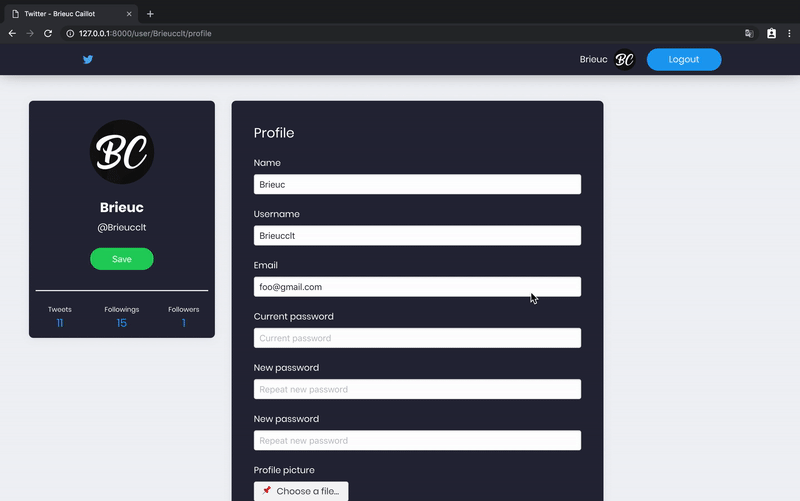

# Twouiter

🐦 Twitter like application made with Laravel & Vuejs

      

----------

### Build setup

 
```shell
# Go to directory
cd twouiter

# Install composer dependencies
composer install

# Install node dependencies
npm install

# Duplicate .env.example as .env

# Run migrations
php artisan migrate

# Run on localhost:8000
php artisan serve
```

----------

### Seeders

- Create 10 users

```shell
php artisan db:seed --class=UsersTableSeeder
```

- Create 10 users with 3 posts for each one

```shell
php artisan db:seed --class=PostsTableSeeder
```

- Create 2 users with one following the other

```shell
php artisan db:seed --class=FollowerTableSeeder
```

- Execute all three seeders at one 

```shell
php artisan db:seed
```

----------

### Timeline

```php
# Web 
Route::get('/', 'PostController@index')->name('home');

# Url
http://localhost:8000/
```


----------

### User

```php
# Web 
Route::get('user/{username}', 'UserController@index')->name('user');

# Url
http://localhost:8000/user/{username}
```


----------

### Profile

```php
# Web 
Route::get('user/{username}/profile', 'ProfileController@index')->name('user.profile');

# Url
http://localhost:8000/user/{username}/profile
```


